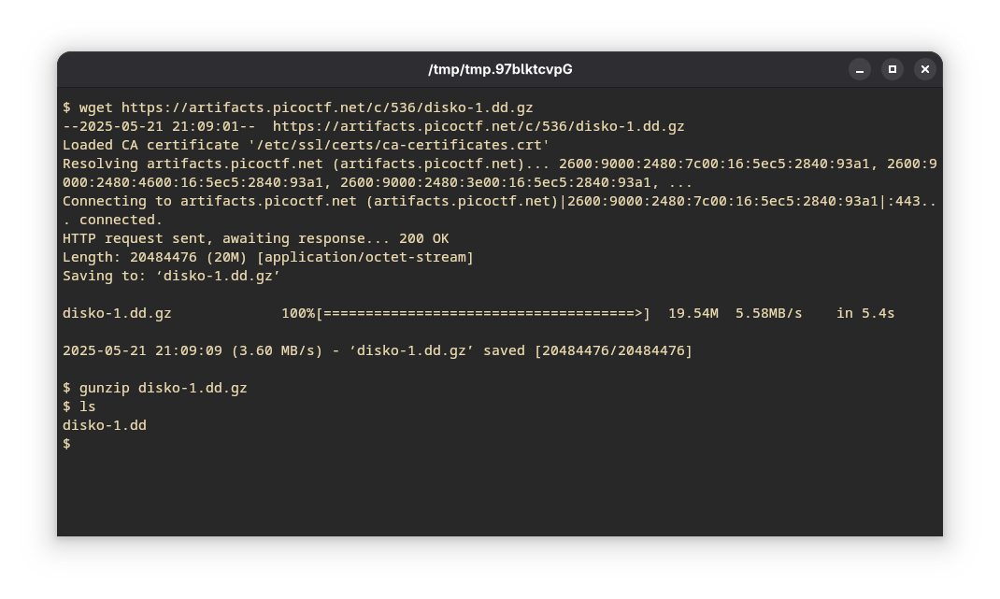
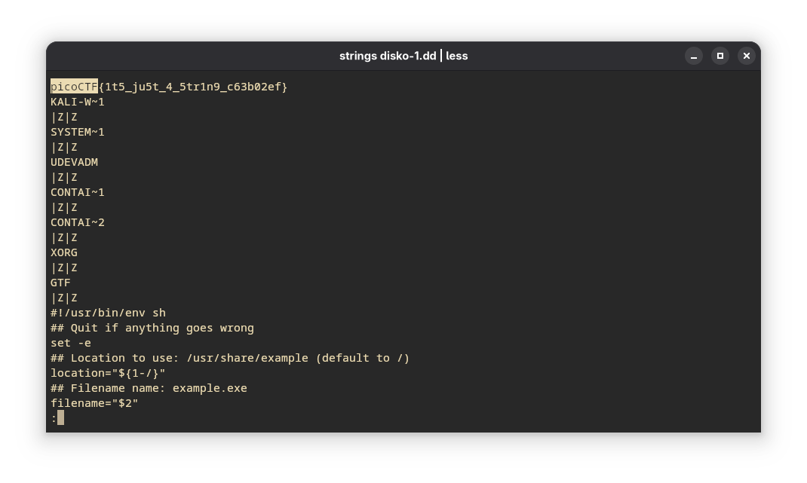

---
tags:
  - Easy
  - Forensics
  - picoGymExclusive
---

1. Download the compressed image
2. Extract the image with the following command
```bash
gunzip disko-1.dd.gz
```

3. Use the `strings` command to find strings in the image. Additionally pipe the output to the `less` command to stop the overflowing of terminal buffer and to search for the flag.

