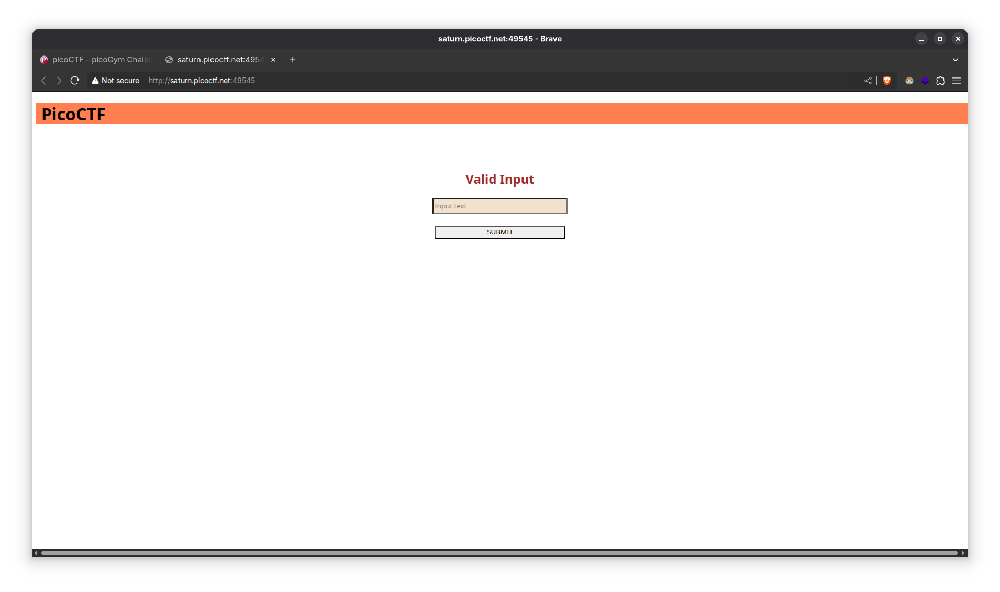
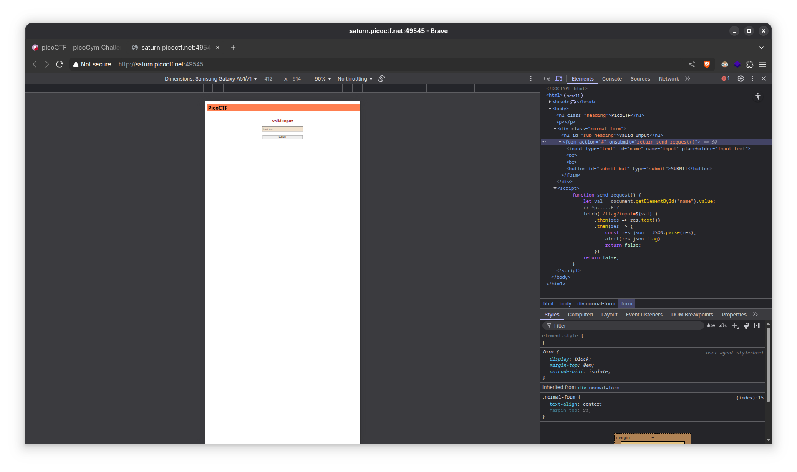
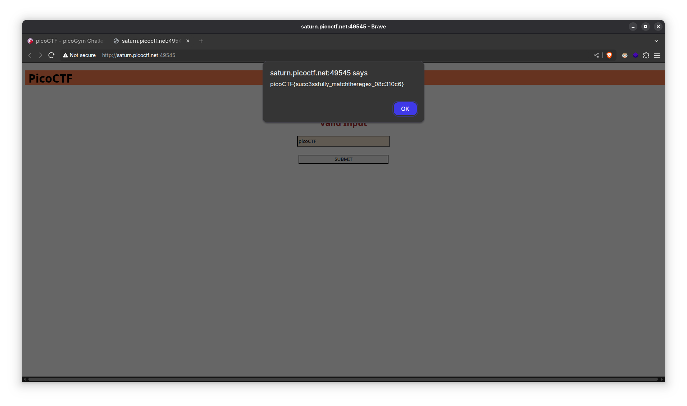

1. Launch the instance

2. Open the URL

3. On inspecting the source code, we can see that the input text of the form is being validated by `fetch()` with a get request to the `/flag` endpoint.

4. Not really a regex match but we'll try matching the known first characters of a flag, i.e. `picoCTF`. And it works!

