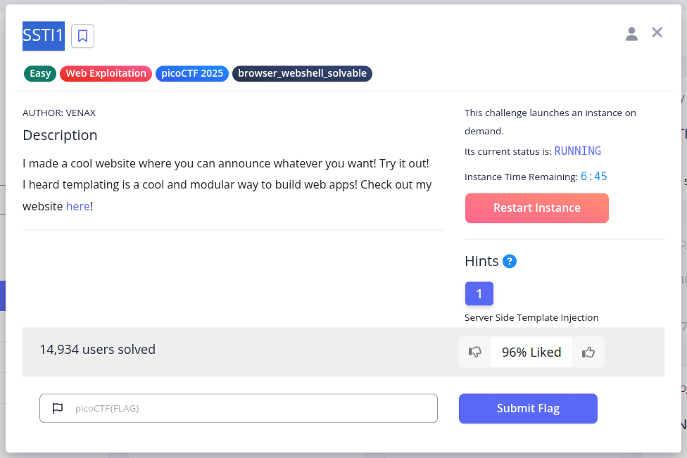
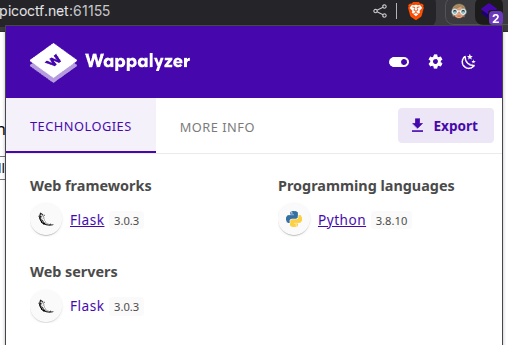
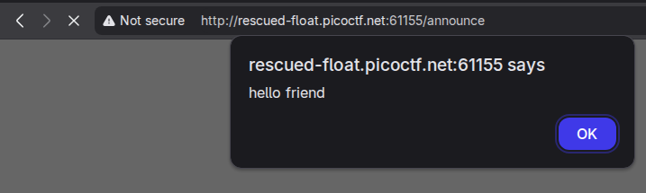
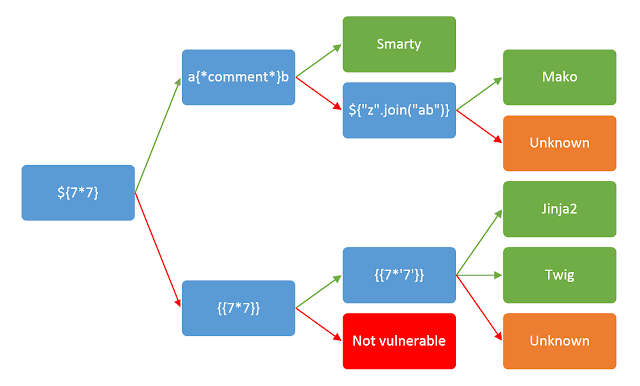
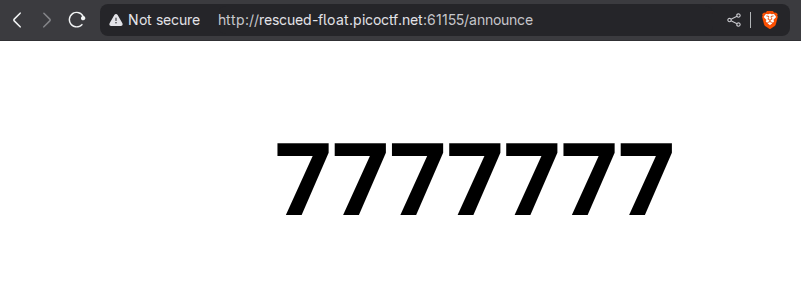
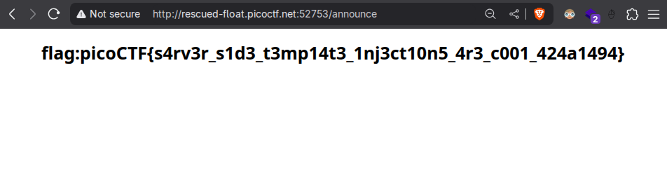

---
tags:
  - Easy 
  - WebExploitation 
  - picoCTF2025 
---

1. Start the Challenge

	

2. Some quick reconnaissance tells us that the website is running on a Flask server.

	

3. Putting in `` tells us that the server is vulnerable to **XSS injection**.  

	

4. Here's where we go a bit off-road. The challenge tells us to use **Server-side template injection**. That's a good start as any. I googled `server side template injection python flask` and came across this page: https://portswigger.net/web-security/server-side-template-injection

5. After trying all the templates, we can infer that the server is running a Jinja2 template engine.

	
	

6. I searched for `server side template injection jinja2 payloads` and came across this article https://www.onsecurity.io/blog/server-side-template-injection-with-jinja2/ `{{request.application.__globals__.__builtins__.__import__('os').popen('id').read()}}` was the demo payload in the article. https://man7.org/linux/man-pages/man3/popen.3.html this tells us that `popen()` takes in strings and executes them as commands. Jackpot! RCE!

7. However, we need it to execute a different command for us. Here's the on that gets us the flag.`{{request.application.__globals__.__builtins__.__import__('os').popen('grep -r "picoCTF"').read()}}` 
	
