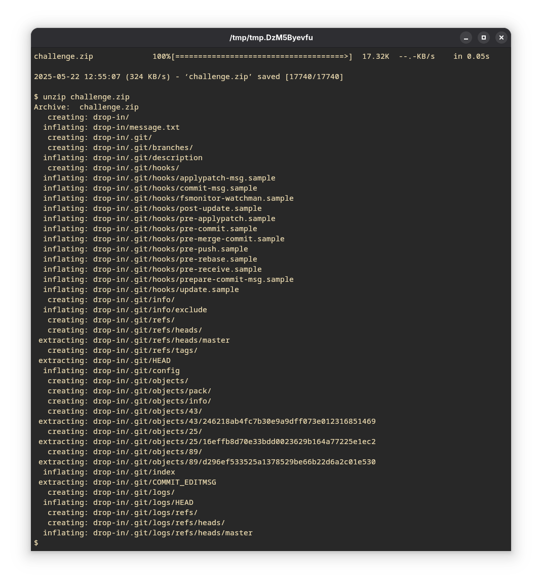
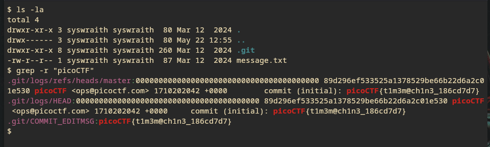

---
Tags:
  - Easy 
  - picoCTF2024 
  - git
---

1. Download the file and unzip it

2. `cd` into the file
3. `ls -la` reveals the `.git` 
4. Use `grep -r "picoCTF"` to recursively grep for the flag.
 

