---
tags:
  - Easy 
  - Cryptography 
  - picoCTF2025
---

1. Problem statement
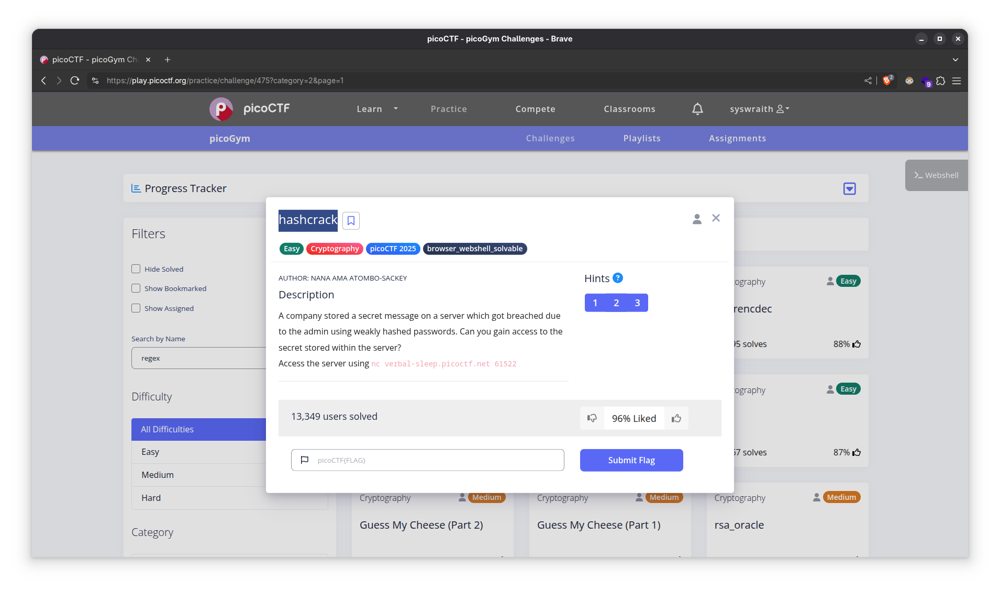
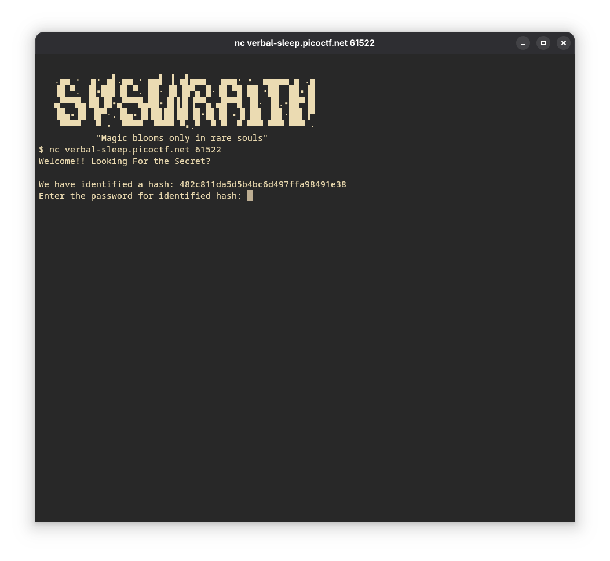
2. Install [hashcat](https://hashcat.net/hashcat/) and [rockyou.txt](https://github.com/brannondorsey/naive-hashcat/releases/download/data/rockyou.txt). Save the identified hash in a file (here I'm saving it in the file `company.hash`).
3. There's a ton of hashing algorithms that `hashcat` can crack. A list of them is available at https://hashcat.net/wiki/doku.php?id=example_hashes
4. Start the bruteforce attack with the following command. The `--show` flag tells us which password matches the given hash.

```bash
hashcat -m 0 company.hash rockyou.txt --show
```

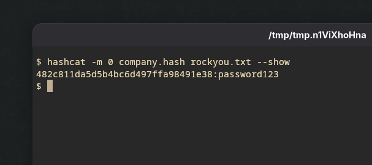

5. On entering the hash, another hash is given to us. This should be fun :)
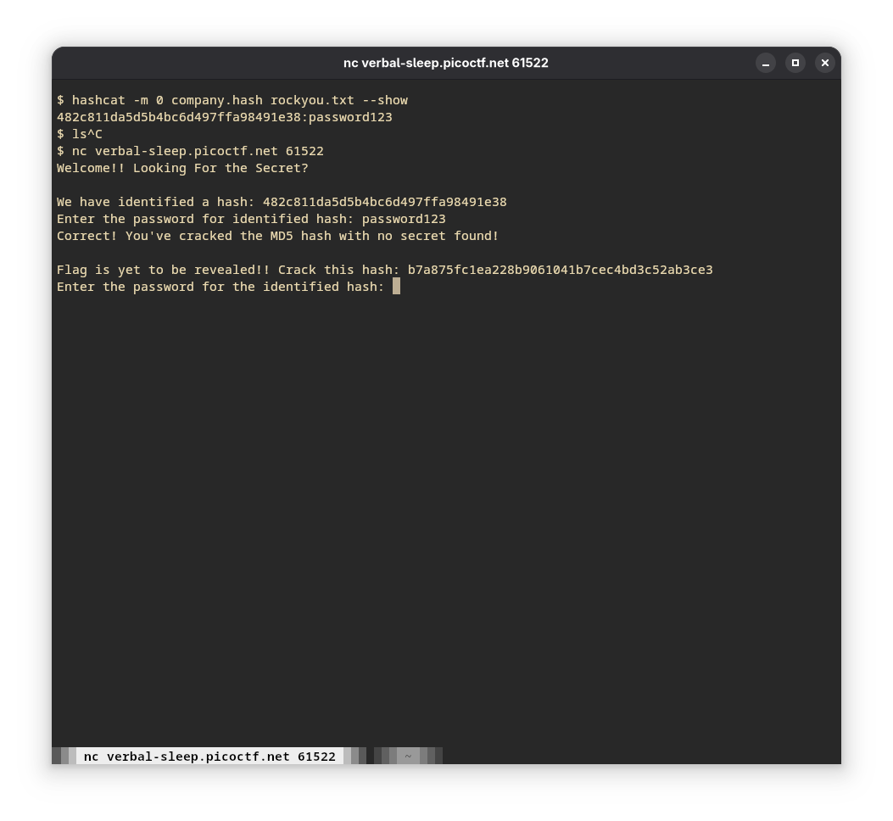
6. On trying to break it with MD5, we get the following error. 

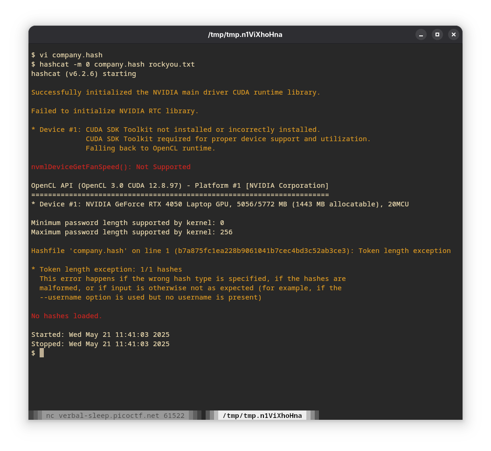
7. Not MD5. Going back to the list mentioned in step 3. Maybe...SHA1? Yes!

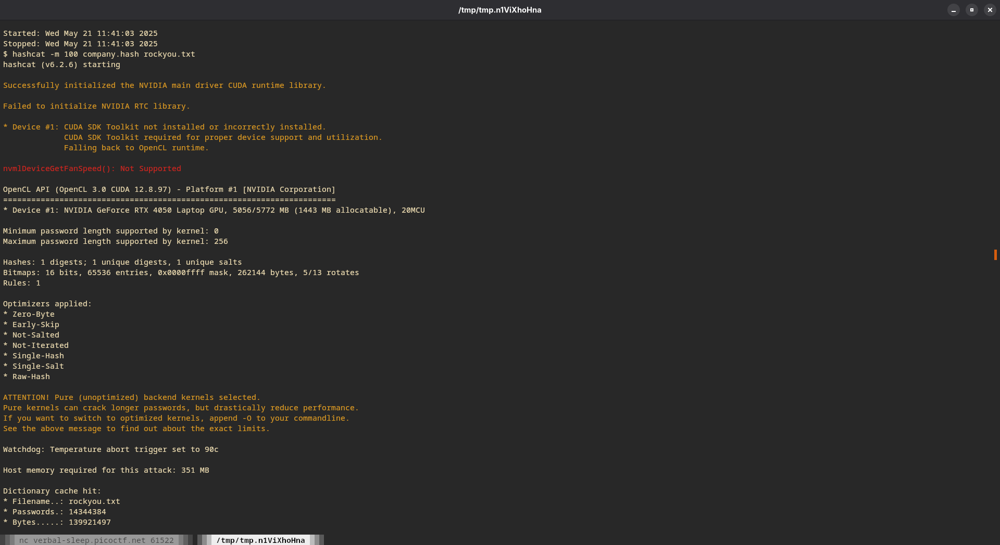
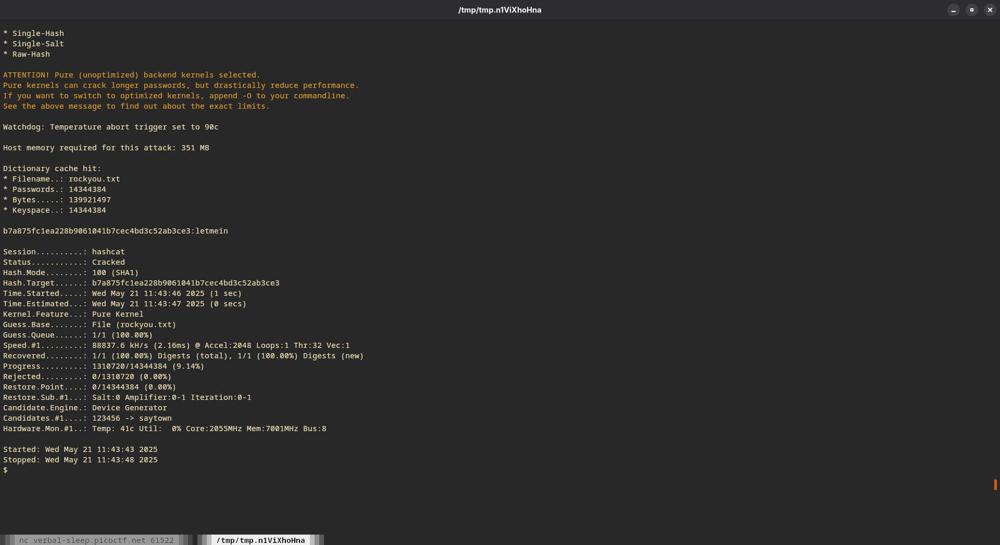

8. Another hash!

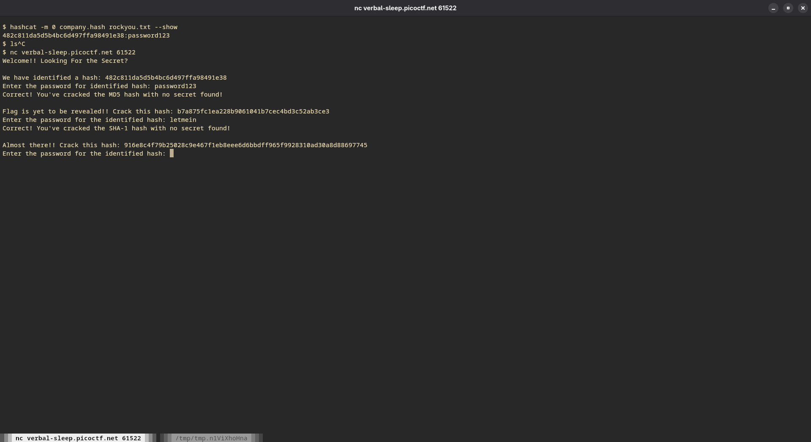

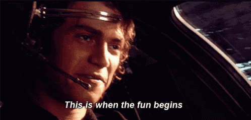

9. Counting the number of characters, we can see that it's 64 characters in length. Which means that we need an algorithm which outputs a 64 character hash. A quick search tells us that `SHA2-256` is what we're looking for.

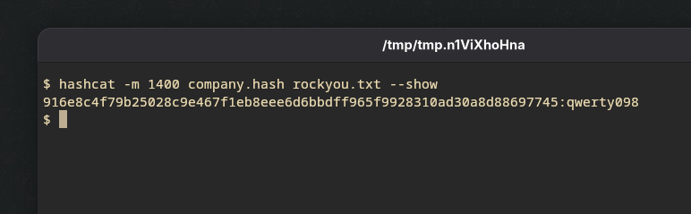

10. And there we have it!

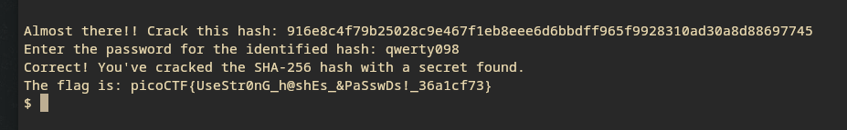

