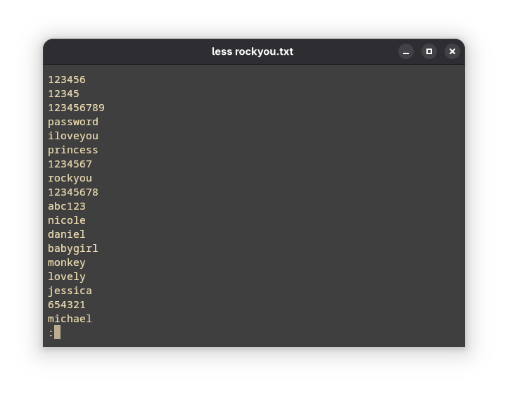

Password math is mind-boggling. 

Say you have a password of about a that can range from 8 to 16 characters. 
There are around 70 typeable keys on a standard QWERTY keyboard. Let's try to make sense of it using some good old series notation.
$$
\sum_{n=8}^{16} 70^n
$$

That gives us a compact notation to represent the entire keyspace in which the password might exist. To put it in numerical figures, it comes out to be somewhere around _337145672445227527877100000000_. 

That’s over a hundred octillion possibilities — more than the estimated number of sand grains on all the beaches of Earth, stars in the Milky Way, and Google searches ever made — combined. And thats just if we limit ourselves to the range of 8 to 16 character long passwords. Major services provide the range of 8 to 100 characters.

So how do we- as mortals- make sense of this seemingly gigantic number? 

Well it's simple really. We focus on the things that are making these passwords- *people*. Man is the most exploitable part of the security ecosystem. About ***95%*** of the security faults happen today, happen because of man.

How would a normal, ignorant person make his passwords? He/She would reuse the words, phrases and figures closest to him. The first few lines of *`rockyou.txt`* make this clear to us:

> *"A man is defined by the company he keeps."*

The whole idea is based around the fact that through his social connections, there might be some words/characters whose combination makes up one of his passwords.  So we need to define a social structure of people that surrounds our target and utilize it to generate the wordlist that we'll eventually use in our attacks. We also need to sort the passwords from high probability to low probability so that we'll reduce time spent in brute-forcing the passwords.

The source code for this project is over at https://github.com/syswraith/ryukendo. If you find something you want to talk about, do contribute by opening an issue or a pull request :)


# General overview

In the `profiles` directory, we define any number of people related to our target. Here's an example:

```json
{
  "first_name": "Aarav",
  "middle_name": "Ishaan",
  "last_name": "Mehta",
  "affiliation": ["ShadowPaws", "mochi_zone", "TeamNova", "ravbyte"],
  "mutuals": 3,
  "intimacy": 3,
  "frequency_of_contact": 2,
  "shared_xp": 3,
  "time_known": 4,
  "numbers": [17, 204, 88]
}
```


There's two main phases I have implement the wordlist generator in: the generation phase and the sorting phase. 
## Generation phase: 
- In this phase, we focus purely on generating all the combinations of the strings present. In the JSON file, the fields `first_name`, `middle_name`, `last_name`, `affiliations`, `numbers` are taken into consideration. 
- Additional special characters can also be added into the affiliations section since it contains anything and everything affiliated to the person. Think pop culture references, favorite book characters, commonly used phrases, nicknames, usernames; anything. 
- Same with the numbers- dates, license plate numbers, phone numbers, pin codes, etc. Go crazy.
## Sorting phase: 
- In this phase, we sort out the passwords. This is done with the help of filters such as `str_in` (string in) and `str_not_in` (string not in) to remove the passwords that are not likely to be in the list. 
- Filters can be added in the `filters` directory. I'm working on some of them but at the time of writing, none of them are ready to be pushed into the repository. Hopefully in the future :) 
- This is useful when you have a general idea of the password that the target is using i.e. maybe you've seen them enter a password and are sure that its of *n* length or has *x* character(s) in it. 
- Another deciding factor is the *closeness* of the person to the target. We will calculate the *Euclidean distance* of the person from *maximum closeness*. This closeness is determined by factors like mutuals, intimacy, frequency of contact, shared experiences and time known. 
$$
\text{Euclidean\ Distance} = \sqrt{\sum_{a \in A} (\text{Max } a - a)^2}
$$
where A = { frequency of contact, shared experiences, mutuals, time known, intimacy }
$$
\text{Closeness} = \frac{1}{1 + \text{Euclidean\ Distance}}
$$

Ideal assumption is that a target's closeness to himself is `1.0`. That is the **ideal closeness**. Any person who comes closer to one is ranked higher in the list.

## Implementation
- Of course, the sorting phase should come before the generation phase. It makes sense to generate the highest probable passwords before the lowest ones, and sorting helps us do just that. That's why we make rounds through the files under profiles to get the closeness of each person, and generate them sequentially according to that order. 
- My friend [tervicke](https://github.com/tervicke) also advised me to use **multi-threading** to speed up the generation process. However, Python doesn't do true multi-threading- the implementation of threads in Python works **concurrently** rather than in parallel. And the **Global Interpreter Lock (GIL)** limits the number of threads operating on Python bytecode in order to protect memory, thus making it a huge bottleneck for performance. 
- I have used multiprocessing instead, where each process gets its own GIL and cores to deal with generating passwords for each person. The time difference is of about 2 seconds, with with the script running faster with multi-processing than on a single-thread.


# Usage
- Clone the repositories locally. 
- There are various make commands in the `Makefile`. The order they should be executed in is as follows:
1.  `make connections` to define your target and connections
2. `make passwords` to start generatng the passwords
3. `make filter` to filter out passwords according to the filters
4. `make clear_cache` to clear the generated cache
5. `make clear_profiles` to clear the generated profiles
6. `make clear_wordlists` to clear the generated wordlists


# Miscellaneous
- Here are some of the most popular wordlist generators that I've taken inspiration from: 
	- https://github.com/D4Vinci/elpscrk/
	- https://github.com/r3nt0n/bopscrk/
	- https://github.com/digininja/CeWL

- You can use CeWL to generate keywords that the person might be affiliated to and add them in the affiliations attribute of the JSON file.
- Munging passwords is a job that is better done by existing tools. The `Hashcat` rule-engine in particular allows for a very good munging. If you want to use it, run the following command and use `hashcat_wordlist.txt` instead `wordlist.txt` of for sorting. Use any rules that you see fit, in this example I'll be using [ stealthsploit's OneRuleToRuleThemStill](https://github.com/stealthsploit/OneRuleToRuleThemStill/).

```bash
hashcat --force wordlist.txt -r OneRuleToRuleThemStill.rule --stdout > hashcat_wordlist.txt
```
